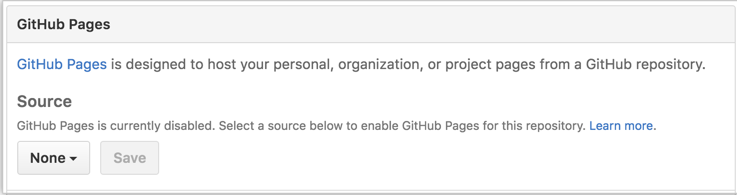
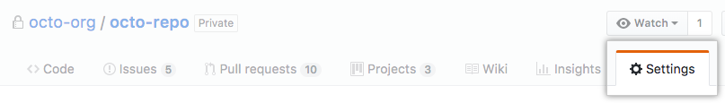
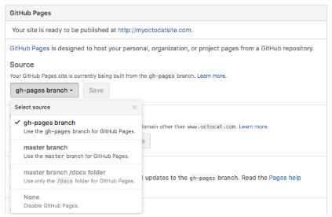

# GitHub Pages Basics

## What is GitHub Pages?

GitHub Pages is a static site hosting service designed to host your personal, organization, or project pages directly from a GitHub repository.

You can create and publish GitHub Pages sites online using the Jekyll Theme Chooser. Or if you prefer to work locally, you can use GitHub Desktop or the command line.

GitHub Pages is a static site hosting service and doesn't support server-side code such as, PHP, Ruby, or Python.

To learn more about the different types of GitHub Pages sites, see "User, organization, and project pages."

> Warning: GitHub Pages sites are publicly available on the internet, even if their repositories are private. If you have sensitive data in your Page repository, you may want to remove it before publishing.

### Guidelines for using GitHub Pages

* GitHub Pages sites created after June 15, 2016 and using github.io domains are served over HTTPS. If you created your site before June 15, 2016, you can enable HTTPS support for traffic to your site.
* GitHub Pages sites shouldn't be used for sensitive transactions like sending passwords or credit card numbers.
* Your use of GitHub Pages is subject to the GitHub Terms of Service, including the prohibition on reselling.

### Usage limits

GitHub Pages sites are subject to the following usage limits:

* GitHub Pages source repositories have a recommended limit of 1GB .
* Published GitHub Pages sites may be no larger than 1 GB.
* GitHub Pages sites have a soft bandwidth limit of 100GB per month.
* GitHub Pages sites have a soft limit of 10 builds per hour.

If your site exceeds these usage quotas, we may not be able to serve your site, or you may receive a polite email from GitHub Support suggesting strategies for reducing your site's impact on our servers, including putting a third-party content distribution network (CDN) in front of your site, making use of other GitHub features, such as releases, or moving to a different hosting service that might better fit your needs.

Additionally, GitHub Pages sites must refrain from:

* Content or activity that is illegal or otherwise prohibited by our Terms of Service or Community Guidelines
* Violent or threatening content or activity
* Excessive automated bulk activity (for example, spamming)
* Activity that compromises GitHub users or GitHub services
* Get-rich-quick schemes
* Sexually obscene content
* Content that misrepresents your identity or site purpose

If you have questions about whether your use or intended use falls into these categories, please contact GitHub Support.

### Further reading

* "GitHub Pages basics"
* Beyond GitHub Pages basics
* GitHub Pages tutorial

## Configuring a publishing source for GitHub Pages
You can configure GitHub Pages to publish your site's source files from master, gh-pages, or a /docs folder on your master branch for Project Pages and other Pages sites that meet certain criteria.

If your site is a User or Organization Page that has a repository named <username>.github.io or <orgname>.github.io, you cannot publish your site's source files from different locations. User and Organization Pages that have this type of repository name are only published from the master branch.

For more information about the different types of GitHub Pages sites, see "User, Organization, and Project Pages."


### Default source settings for repositories without the username naming scheme
The default settings for publishing your site's source files depend on your site type and the branches you have in your site repository.

If your site repository doesn't have a master or gh-pages branch, your GitHub Pages publishing source is set to None and your site is not published.



After you've created either a master or gh-pages branch, you can set one as your publishing source so that your site will be published.

If you fork or upload your site repository with only a master or gh-pages branch, your site's source setting will automatically be enabled for that branch.

### Enabling GitHub Pages to publish your site from master or gh-pages
To select master or gh-pages as your publishing source, you must have the branch present in your repository. If you don't have a master or gh-pages branch, you can create them and then return to source settings to change your publishing source.

1. On GitHub, navigate to your GitHub Pages site's repository.

2. Under your repository name, click  Settings.


3. Use the Select source drop-down menu to select master or gh-pages as your GitHub Pages publishing source.


4. Click Save.

### Publishing your GitHub Pages site from a /docs folder on your master branch
To publish your site's source files from a /docs folder on your master branch, you must have a master branch and your repository must:

* have a /docs folder in the root of the repository
* not follow the repository naming scheme <username>.github.io or <orgname>.github.io

GitHub Pages will read everything to publish your site, including the CNAME file, from the /docs folder. For example, when you edit your custom domain through the GitHub Pages settings, the custom domain will write to /docs/CNAME.

> Tip: If you remove the /docs folder from the master branch after it's enabled, your site won't build and you'll get a page build error message for a missing /docs folder.

1. On GitHub, navigate to your GitHub Pages site's repository.
2. Create a folder in the root of your repository on the master branch called /docs.
3. Under your repository name, click  Settings.
4. Use the Select source drop-down menu to select master branch /docs folder as your GitHub Pages publishing source.
> Tip: The master branch /docs folder source setting will not appear as an option if the /docs folder doesn't exist on the master branch.

5. Click Save.

### Further Reading
* Viewing branches in your repository

## User, Organization, and Project Pages
There are two basic types of GitHub Pages sites: Project Pages sites, and User and Organization Pages sites. They are nearly identical but have some important differences.

Project Pages sites are connected to a specific project, and the site files live on a branch within the project repository. User and Organization Pages sites are not tied to a specific project, and the site files live in a special repository dedicated to GitHub Pages files.

>Tip: GitHub Pages sites are always publicly accessible when published, even if their repository is private, and they shouldn't be used for sensitive transactions like sending passwords or credit card numbers. For more information, see "What is GitHub Pages?"

>Warning: If the URL for your GitHub Pages site contains a username or organization name that begins or ends in a dash, or contains consecutive dashes, then people browsing with Linux will receive a server error when they visit the site. To fix this, change your GitHub username to remove non-alphanumeric characters. For instructions on how to do this, see "Changing your GitHub username."

### Project Pages sites
The source files for Project Pages sites live within the same repository as their project, and they are published from one of the following locations:

* The master branch
* The gh-pages branch
* A folder named "docs" located on the master branch

For more information, see "Configuring a publishing source for GitHub Pages."

#### Building Project Pages sites
Both personal and organization accounts can create Project Pages sites, and the steps for creating Project Pages sites are the same for both.

Project Pages sites are available in the following locations after they're built:

* A Project Pages site for a personal account is available at `http(s)://<username>.github.io/<projectname> `.
* A Project Pages site for an organization account is available at `http(s)://<orgname>.github.io/<projectname> `.

If you're using a custom domain, see "Custom domain redirects for GitHub Pages sites."

#### Using a custom domain with your Project Pages site
f you are using a custom domain with a User or Organization Pages site, the custom domain replaces username.github.io in the URL for all Project Pages sites hosted under that account. Project Pages sites that use a custom domain are also available at username.github.io/projectname for personal accounts, and orgname.github.io/projectname for organizations. For more information, see "Using a custom domain with GitHub Pages."

Custom 404 error pages only work if a custom domain is used. Otherwise, the default User Page 404 is used. For more information, see "Creating a custom 404 for your GitHub Pages site."

### User and Organization Pages sites
The source files for User and Organization Pages sites live on the master branch in a dedicated repository named with the GitHub account name:

* To create a User Pages site, name the repository using the naming scheme `<username>.github.io` .
* To create an Organization Pages site, name the repository using the naming scheme `<orgname>.github.io` .

#### Building User and Organization Pages sites
User and Organization Pages sites are available in the following locations after they're built:

* A User Pages site is available at `http(s)://<username>.github.io` .
* An Organization Pages site is available at `http(s)://<orgname>.github.io` .
* If you're using a custom domain, see "Custom domain redirects for GitHub Pages sites."

User Pages sites can be built by any user account with a verified email address. They can also use deploy keys to automate the process. For more information, see "Managing deploy keys" in the GitHub Developer documentation.

Organization Pages sites can be built by any member with push access to the repository and a verified email address. To automate builds, you can set up a machine user as a member of your organization. For more information, see "Managing deploy keys." Deploy keys aren't supported for Organization Pages sites.


### Further reading

## Creating Project Pages using the command line
### Make a fresh clone
To set up a Project Pages site, you need to create a new "orphan" branch (a branch that has no common history with an existing branch) in your repository. The safest way to do this is to start with a fresh clone:

```
git clone https://github.com/user/repository.git
# Clone our repository
Cloning into 'repository'...
remote: Counting objects: 2791, done.
remote: Compressing objects: 100% (1225/1225), done.
remote: Total 2791 (delta 1722), reused 2513 (delta 1493)
Receiving objects: 100% (2791/2791), 3.77 MiB | 969 KiB/s, done.
Resolving deltas: 100% (1722/1722), done.
```

### Create a master branch
Once you have a clean repository, you'll need to create a new master branch unless your cloned repository already has a master branch.

> Tip: You can also create a gh-pages branch for your Project Pages site instead. To learn more about your options, including the option to publish your Project Page from a /docs folder on your master branch, see "User, Organization, and Project Pages."

1. Switch directories into your new cloned repository:
```
cd repository
```
2. Check if your repository already has a master branch:

```
git branch
# shows a list of branches for your repository
* branch-name
* branch-name
```

3. If you don't already have a master branch in your repository, create a new master branch:

```
git checkout --orphan master
# Creates a master branch, without any parents (it's an orphan!)
Switched to a new branch 'master'
```
> Tip: If you just created the master branch, it won't appear in your list of branches when you use the git branch command until you make your first commit.


### Remove all files to create an empty working directory
### Add content and push
### Load your new GitHub Pages site

## Securing your GitHub Pages site with HTTPS
### Resolving problems with mixed content
#### Examples of how assets may be referenced in an HTML file


## Unpublishing a Project Pages site
### Further reading

## Unpublishing a User Pages site
### Further reading

## Further reading on GitHub Pages
See "[Customizing GitHub Pages](https://help.github.com/categories/customizing-github-pages/)" for more information on using approved Jekyll plugins with GitHub Pages sites, creating custom 404 pages, and viewing available repository metadata.

See "[Troubleshooting GitHub Pages builds](https://help.github.com/articles/troubleshooting-github-pages-builds)" and "[Troubleshooting custom domains](https://help.github.com/articles/troubleshooting-custom-domains)" for further help.


